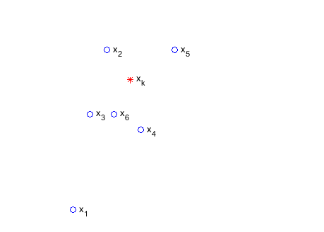
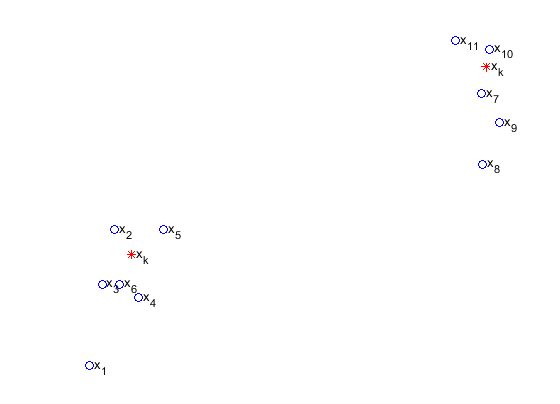
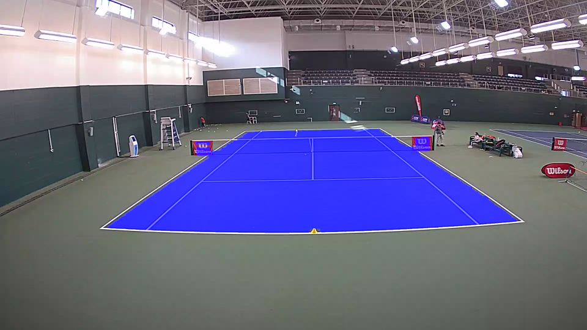
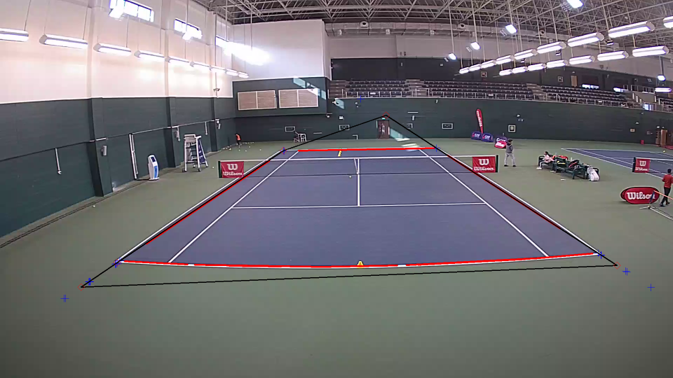
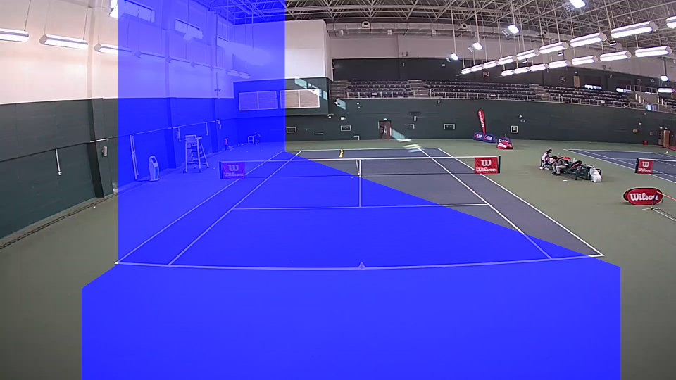
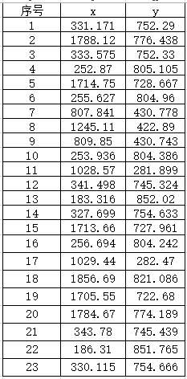
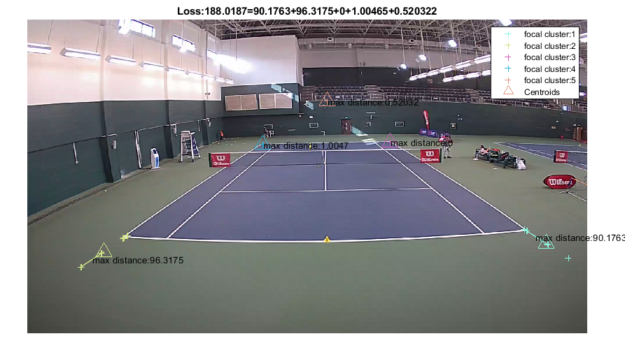
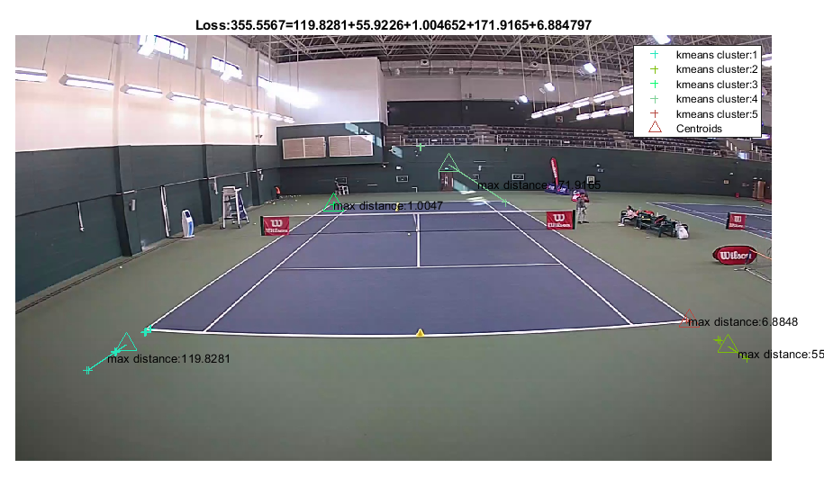
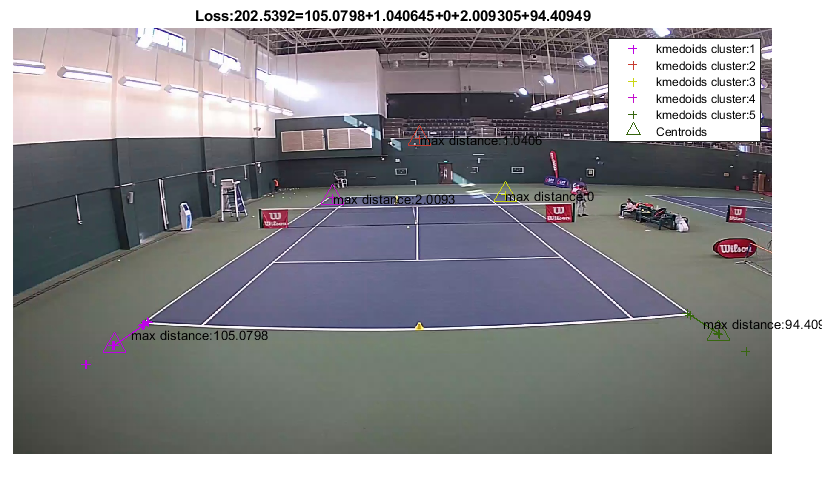
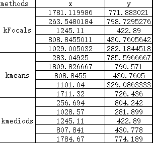

# kFocals: a new clustering algorithm
>
author: 崔星星  2021.1.29

>通常，聚类算法旨在将n个观察值划分为k个群集，其中每个观察值均属于具有最近均值的群集（群集中心center或群集质心centroid），作为群集的原型。典型的如kmeans、kmedoids等方法可以把大多数聚集在一块的分到一块，指定k的值，算法会自动分为k个类簇，但是在某些情况下，这些算法并非有效，当个别观察值数量非常有限而且对簇类中心非常有用的时候，这些算法会受到这些outlier的影响最终影响聚类质量而且群集中观察值的密度也对聚类质量有较大影响。本文提出一种新的聚类算法——**kFocals，聚焦（focal）距离较远的观察值影响，降低群集中每个观察值的作用**，正是解决此类问题的有效方法，根据项目中实际所遇到的数据进行了实验，实验证明所求的解达到最优。

## 一、问题建立

- 假如我们有一批群集观察值$X_i =\left\lbrace x_1 ,x_2 ,x_3 ,\ldotp \ldotp \ldotp x_n \right\rbrace$，每个观察值较为可信，不存在outlier的影响，在二维空间中的位置分布如下：

其中$x_k$可以来源于观察值$X_i$或者平面内任意的位置$x_k =\left(a_k ,b_k \right)$，不妨假设来源于$X_i$，距离采用欧式距离，定义如下子目标函数：

$$\begin{equation} d\left(x_i ,x_k \right)=\sqrt{{\left(a_i -a_k \right)}^2 +{\left(b_i -b_k \right)}^2 } \end{equation} $$

$$\begin{equation} f\left(x_k \right)=\underset{x_k \in X_i }{\max \;\left(d\left(x_i ,x_k \right)\right)}\end{equation} $$

一个问题是如何找到簇类中心${{\mathrm{c}}_i =x}_k$，使得$f\left(x_k \right)$达到最小，记

$$\begin{equation} S_i =\min \left(f\left(x_k \right)\right)\end{equation} $$

   \item{ 同样类似于上步骤在另一位置存在一组群集$X_j =\left\lbrace x_1 ,x_2 ,x_3 ,\ldotp \ldotp \ldotp x_n \right\rbrace$，也可以在该$X_j$下寻找到合适的${\mathrm{c}}_j$值使得满足$S_j =\min \left(f\left(x_k \right)\right)$,其中$X_j$中任何一个点都归属于该簇类中心${\mathrm{c}}_j$，也就是说$X_j$中任何一个点都比其与其他的簇类中心${\mathrm{c}}_i$的距离都要小，这样才能保证属于该类簇。示意图如下： }

   \item{ 对于给定的聚类数量$K$，可以计算得到一组局部最优的簇类中心$C =\left\lbrace {\mathrm{c}}_1 ,{\mathrm{c}}_2 ,\ldotp \ldotp \ldotp ,{\mathrm{c}}_k \right\rbrace$,定义如下总目标函数： }

$$\begin{equation}L=\sum_{i=1}^K S_i\end{equation} $$

根据（1）-(4)式，可得：

$$\begin{equation}L=\sum_K \min \left(\underset{x_k \in X_i }{\max \;\left(d\left(x_i ,x_k \right)\right)} \right)\end{equation}$$

最终求解问题为：如何寻找$K$个簇类中心$C =\left\lbrace {\mathrm{c}}_1 ,{\mathrm{c}}_2 ,\ldotp \ldotp \ldotp ,{\mathrm{c}}_k \right\rbrace$，使得$L$达到最小，即本问题中最终的优化目标函数。

## 二、与kmeans、kmedoids算法的联系与区别

- kFocals聚类算法中心思想可以表述为：寻找$K$个簇类中心，使得每个样本点到其簇类中心点的最大欧式距离之和（即k个最大距离之和）达到最小，而非所有观察值平均距离达到最小，聚类结果更倾向于具有代表性位置的点。
- 联系：都需要事先指定聚类数量$K$，都属于无监督学习算法。
- 区别：跟观察值数量、密度分布无关系，跟outlier位置有很大影响。
- 算法适用场合：距离越"偏"的点越有可能单独聚为一类，越集中分布的点聚类权重较低，对总体聚类质量影响越小，算法对集中的观察点数量密度分布无关系。

## 三、背景实验

### 3.1 背景实验

在球员动作分析对比项目中的一个子进程中，处理球场图像遇到这么一个问题，在球场通过海康全视角相机获取到的一副图像如下，figure1中蓝色高亮区域为项目中算法自动获取的球场区域，figure2中红色和黑色线条分别表示通过某些算法检测和计算得到的，figure3是有“问题”的一张图像，因为蓝色高亮区域偏了，经查找原因出现在figure2中kmeans算法工作并没有达到期望的目的，故引发了前面的分析工作，提出了kFocals聚类算法。

> figure1 动作分析项目中算法处理的球场区域部分

> figure2 算法处理的中间过程图（蓝色"+"符号表示为红色线条交点坐标，红色“♦”符号表示kmeans聚类中心）

> figure3 蓝色高亮有“问题”的区域

### 3.2 实验设置及分析

figure2中蓝色"+"符号所有点集合即为上面分析中的$X$，红色“♦”符号即为上面分析中的$C$，数据变量分别在程序中记为pts,centers.数据详情为：

> tab1.原始数据

对以上数据分别采用kmeans、kmedoids、kFocals进行聚类，聚类数量设定$K=5$，最大迭代次数max_iters为100，preserve设定为false（即群集中心center不来源于观察值），初始种子选取均为kmeans++，算法达到最大迭代次数或者损失$L$不再减小为算法终止。实验结果如下：

> figure4. kfocals结果

> figure5. kmeans结果

> figure6. kmediods结果

> tab2.群集中心center

实验分析：其中kFocals算法由于目标函数稍显特殊性，并不能通过一般迭代寻优求解，经过粒子群算法可收敛全局最优解（loss达到188.0187）。kmeans等算法在上述目标函数约束下，极易陷入局部最优，而且求解结果也不稳定，上图中loss达到355.55667,kmediods方法loss达到202.5392，均高于本文提出的kFocals算法。

## 四、结论

 通过上述实验分析可知，在本项目中所提出的新算法kFocals聚类总损失值均小于其他2类方法，能够聚焦（focal）距离较远的观察值影响，降低群集中每个观察值的作用，算法在合适的优化器求解下，可以达到全局最优解，从而证明了方法的有效性。

## 五、Reference

[1] [k-means clustering](<https://en.wikipedia.org/wiki/K-means_clustering>)

[2]  [k-medoids](https://en.wikipedia.org/wiki/K-medoids)

[3]  Arthur, David, and Sergi Vassilvitskii. “K-means++: The Advantages of Careful Seeding.” *SODA ‘07: Proceedings of the Eighteenth Annual ACM-SIAM Symposium on Discrete Algorithms*. 2007, pp. 1027–1035.
